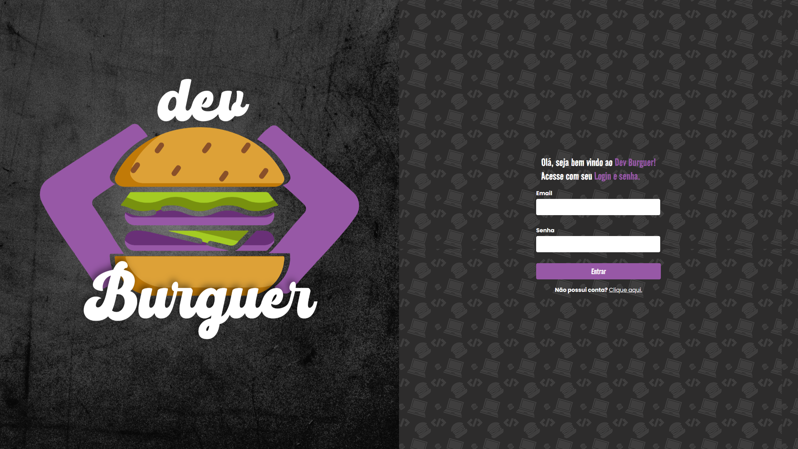
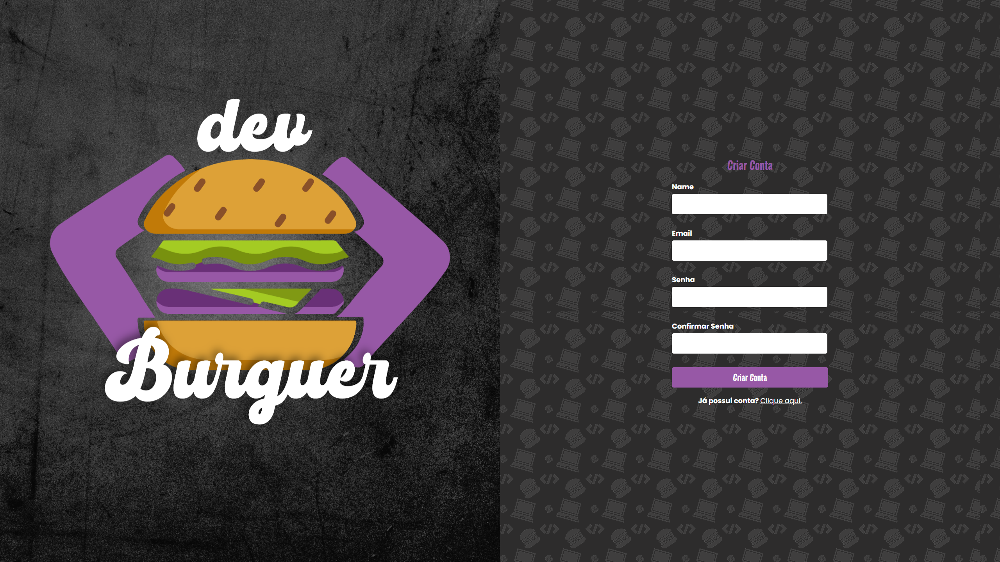
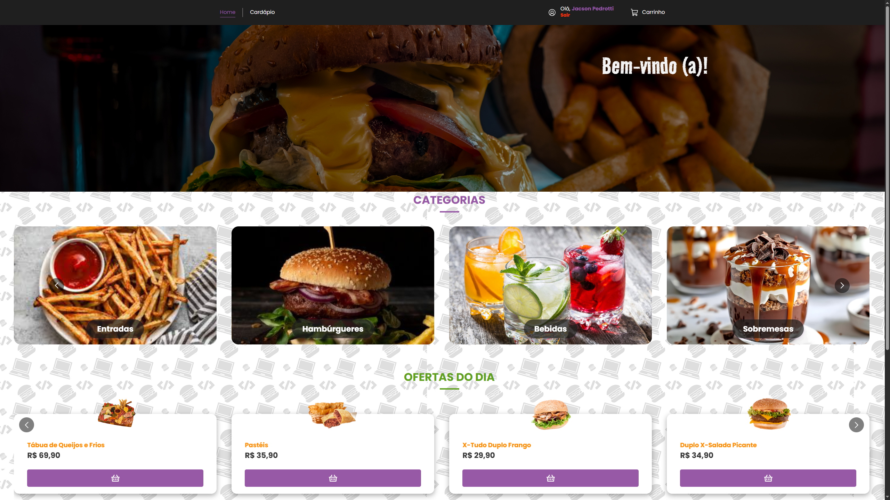
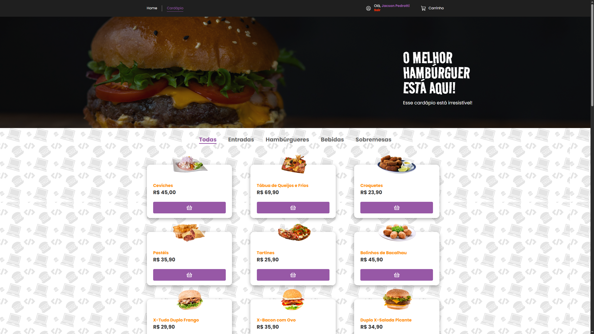
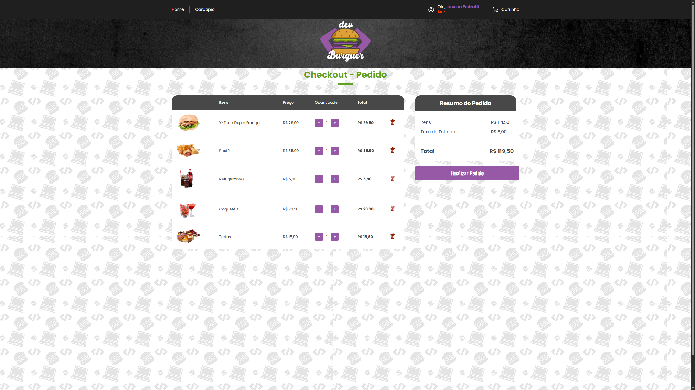
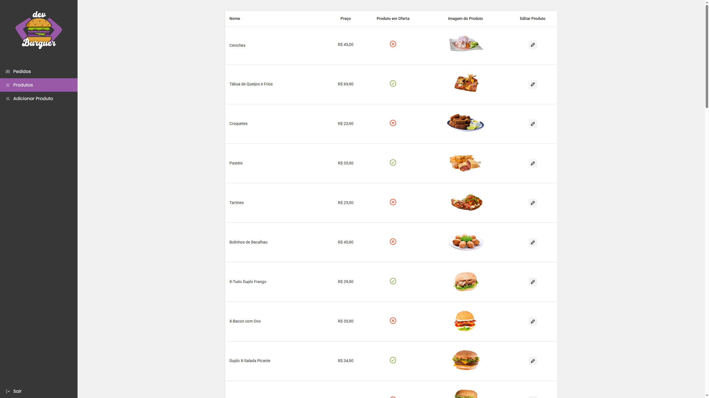
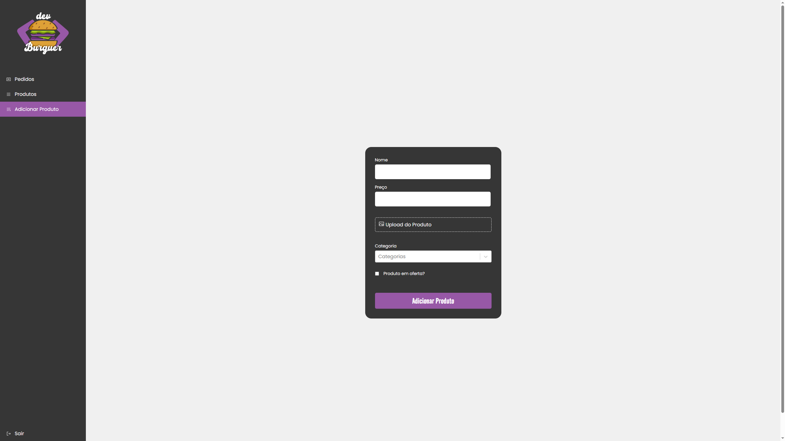
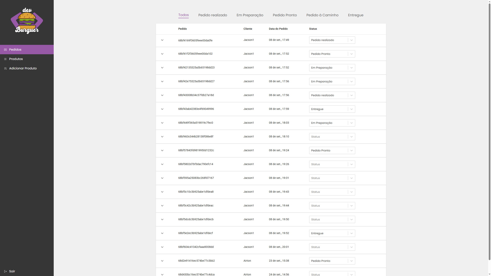

## Dev Burguer — Interface Web

Aplicação React para um e-commerce de hambúrgueres com fluxo completo de compra, carrinho, autenticação de usuários e painel administrativo. A interface consome uma API (base `http://localhost:3001`) e integra com Stripe para pagamentos.

### Paleta e Tipografia (tema)
- Roxo principal: `#9758a6`
- Roxo escuro: `#5c2669`
- Laranja: `#ff8c05`
- Preto principal: `#1f1f1f`
- Cinza claro: `#cdcdcd`
- Verde: `#61a120`
- Branco: `#ffffff`
- Fontes: Road Rage (títulos) e Poppins (texto)

---

### Visão Geral
- Catálogo com categorias e ofertas
- Carrinho persistido em contexto
- Checkout com Stripe (Payment Intent)
- Autenticação e perfis (usuário e admin)
- Painel Admin: pedidos (com mudança de status), produtos (listar/editar) e novo produto

---

### Screenshots
As imagens abaixo estão na pasta `src/assets`.

1. Tela de Login
   

2. Tela de Cadastro
   

3. Tela Principal após Login
   

4. Cardápio / Catálogo
   

5. Carrinho
   

6. Admin — Produtos
   

7. Admin — Adicionar Produto
   

8. Admin — Pedidos (alteração de status via select)
   

---

### Funcionalidades Principais

- Página inicial (`/`): banners, carrossel de categorias e ofertas.
- Cardápio (`/cardapio`):
  - Lista categorias via `GET /categories` e produtos via `GET /products`.
  - Filtro por categoria via query `?categoria=<id>`.
  - Exibição de produtos com preço formatado e ação de adicionar ao carrinho.
- Carrinho (`/carrinho`):
  - Listagem de itens, aumentar/diminuir quantidade e remoção.
  - Resumo de valores e botão para checkout.
- Checkout (`/checkout`):
  - Criação do Payment Intent no backend (`POST /create-payment-intent`).
  - Renderização do formulário Stripe e finalização do pagamento.
  - Redirecionamentos de sucesso/erro e página de conclusão (`/complete`).
- Autenticação:
  - Login (`/login`) com `POST /session` e armazenamento de token/localStorage.
  - Cadastro (`/cadastro`) com `POST /users`.
  - Contexto de usuário com persistência e logout.
- Área Admin (`/admin/*`):
  - Proteção de rota via flag `admin` do usuário no `localStorage`.
  - Pedidos (`/admin/pedidos`): listagem, filtro por status e mudança de status via select.
  - Produtos (`/admin/produtos`): tabela com nome, preço, oferta, imagem e ação de editar.
  - Editar Produto (`/admin/editar-produto`): formulário com edição e upload.
  - Novo Produto (`/admin/novo-produto`): formulário com validação (Yup), upload e seleção de categoria.

---

### Arquitetura & Tecnologias

- React 19 + Vite
- React Router v7
- styled-components 6 (tema + estilos globais)
- React Hook Form + Yup
- Axios (interceptor com Bearer Token)
- Stripe (react-stripe-js / stripe-js)
- Material UI (tabelas) e Phosphor Icons
- React Toastify (notificações)
- Carrosséis: `react-multi-carousel`

---

### Pré-requisitos

- Node.js 18+
- Backend em execução na porta `3001` com as rotas utilizadas:
  - `POST /session`, `POST /users`
  - `GET /categories`, `GET /products`, `POST /products`, `PUT /products/:id`
  - `GET /orders` (e endpoints correspondentes para atualização de status)
  - `POST /create-payment-intent`

> A base da API é configurada em `src/services/api.js` e utiliza `localStorage` (`devburguer:userData`) para obter o token JWT no header `Authorization`.

---

### Configuração do Stripe

1. Crie uma conta Stripe e obtenha as chaves de teste.
2. No frontend, a chave pública é carregada em `src/Config/stripeConfig.js` via `loadStripe("pk_test_...")`.
3. No backend, implemente `POST /create-payment-intent` retornando `clientSecret`.
4. O componente `CheckoutForm` consome o `clientSecret` para finalizar o pagamento.

> Substitua a chave pública de teste no arquivo de config quando necessário.

---

### Como executar

Usando npm:
```bash
npm install
npm run dev
```

Usando yarn:
```bash
yarn
yarn dev
```

Build de produção:
```bash
npm run build
npm run preview
```

---

### Estrutura de Pastas (resumo)

```
src/
  assets/                # imagens e ícones
  components/            # componentes reutilizáveis (Button, Header, Carrosséis, Tabelas, Stripe)
  containers/            # páginas (Home, Menu, Cart, Checkout, Admin/*)
  hooks/                 # UserContext e CartContext
  layouts/               # UserLayout e AdminLayout
  routes/                # definição de rotas
  services/              # api axios (baseURL e interceptors)
  styles/                # tema e estilos globais
  utils/                 # formatadores (preço, data)
```

---

### Rotas

- `/` — Home
- `/cardapio` — Cardápio
- `/carrinho` — Carrinho
- `/checkout` — Checkout
- `/complete` — Conclusão do pagamento
- `/login` — Login
- `/cadastro` — Cadastro
- `/admin/pedidos` — Pedidos (Admin)
- `/admin/novo-produto` — Novo Produto (Admin)
- `/admin/editar-produto` — Editar Produto (Admin)
- `/admin/produtos` — Produtos (Admin)

---

### Segurança e Acesso

- As rotas Admin exigem usuário com `admin: true` no objeto salvo em `localStorage` como `devburguer:userData`.
- O interceptor do Axios injeta o token JWT em `Authorization: Bearer <token>`.

---

### Créditos

Desenvolvido com ❤️ utilizando React, Vite e Stripe.
